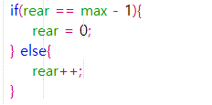

# Jawaban Pertanyaan Jobsheet 10

1. Untuk menyimpan data Queue

2. Untuk menyimpan nilai indeks array data maksimal, data antrian, data terdepan, dan data paling belakang di Queue 

3. Karena data masih kosong sehingga front dan rear tidak menunjuk ke data manapun

4. Maka terjadi kesalahan data yaitu tersisa 1 antrian lagi karena karena data antrian (size) lebih kecil daripada data maksimum sehingga masih tersisa antrian yang belum penuh

5. Rear berada pada indeks terakhir

6. 
    

7. Untuk bisa mnegulang data

8. 
    

9. Data yang paling depan dari queue tidak berada di indeks terakhir array

10. 
    

11. Karena front tidak selalu berada di indeks ke-0

12. Untuk menampilkan semua data yang ada di dalam queue

13. Source code :
    
    

    Output :
    