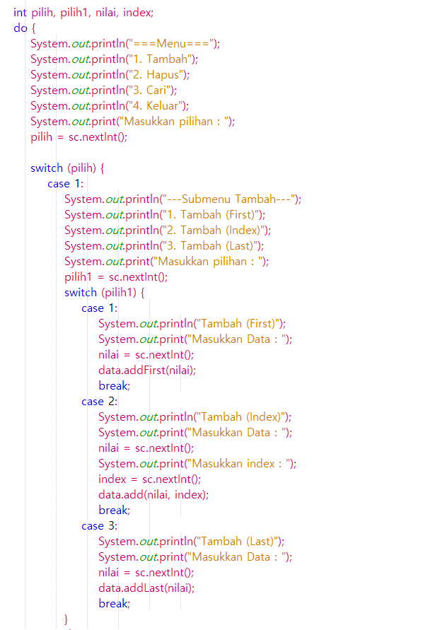
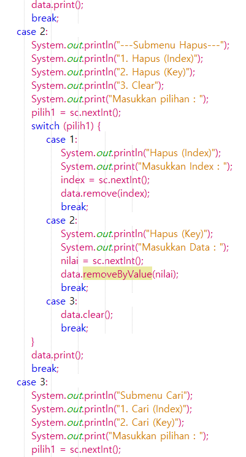
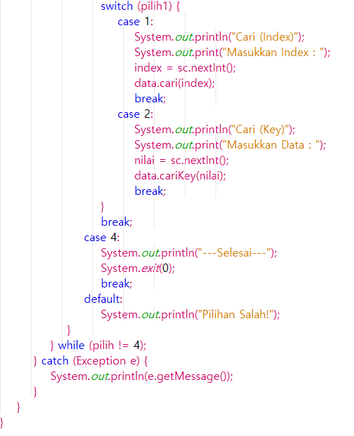

# Jawaban Pertanyaan Praktikum

1. Tranverse adalah operasi yang digunakan untuk mencetak dam memproses penambahan data di akhir linked lists. Jadi fungsi head perlu disimpan di variabel tmp adalah agar ketika penambahan data baru head tidak berubah. Data yang baru akan menempati tmp saja dan head tetap berisi data.

2. Tidak akan bisa menambah data baru di belakang, karena perubahan data baru membutuhkan tail yang mengikat node baru. Secara singkatnya agar head tidak berubah atau bergeser.

3. 

main :

output :

4. 

main :

output :

5. 

main : 

output :

#### Modifikasi terdapat pada project Pertemuan11, package praktikum, class ModifikasiLinkedList dan MainModif
