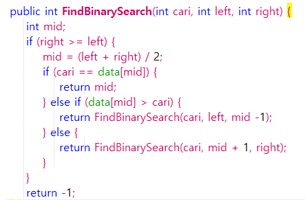

# Jawaban Pertanyaan Praktikum Sequential Search
1.)

 
untuk membuat konstruktor dari kelas Searching yang memiliki parameter yang nantinya digunakan untuk memberi nilai atribut jmlData dan atribut data[]

2.)

untuk menghentikan perulangan agar tidak melakukan pengecekan pada indeks selanjutnya. Jika data yang dicari telah ditemukan, break akan dijalankan sehingga tidak mencari lagi data di indeks selanjutnya

3.)

program masih berjalan.output yang dikeluarkan juga benar.karena pada algoritma sequential search pencarian indeks dilakukan secara urut sesuai data array dari depan ke belakang sampai data ditemukan sehingga walaupun data tidak urut data akan tetap ditemukan

# Jawaban Pertanyaan Praktikum Binary Search
1.) Proses Divide

2.) Proses Conquer

3.)
Modifikasi :

4.)

prgram masih dapat berjalan.namun pada binary search data tidak dapat ditemukan karena pada algoritma binary search data harus dalam kondisi terurut agar data yang dicari dapat ditemukan.sedangkan pada sequuential search tetap berjalan karena pada algoritma sequential search pencarian indeks dilakukan secara urut sesuai data array dari depan ke belakang sampai data ditemukan

5.)

Modifikasi program di  package TestSearching nama file ModifSearchingMain.java