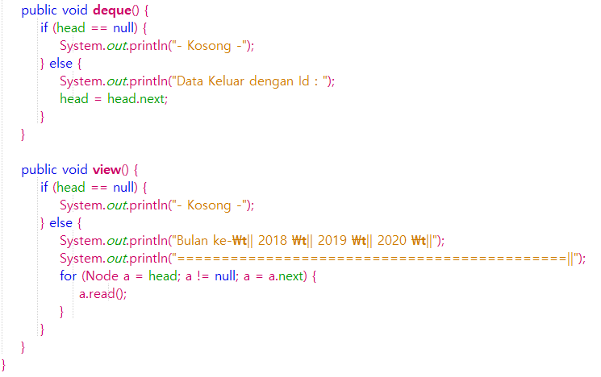
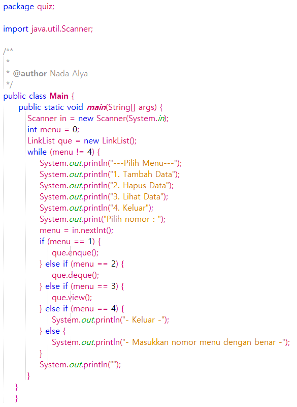
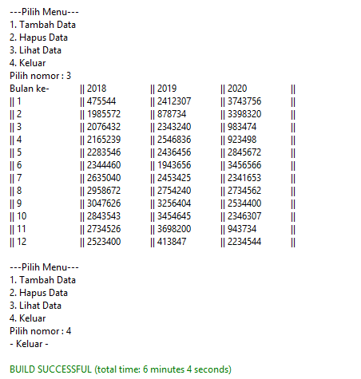

# LAPORAN QUIZ
## Nama : Nada Alya K (22)
## NIM  : 1941720139

#### 1. KODE PROGRAM
##### Source Code

class Node

class LinkList

class Main

##### Output

#### 2. FLOWCHART
##### Gambar

##### Penjelasan 

Program tentang menyimpan data pada tahun 2018,2019,2020. Dengan cara menambahkan data dan bulan pada tahun. Lalu data yang telah dimasukkan semua akan dapat ditampilkan pada program. Pada program saya menggunakan LinkedList dan Stack.
Saya menggunakan 3 class. 1 class Node saya gunakan untuk input data pertahun dan bulan. class LinkList untuk LinkedList dan Stack nya. class Main untuk run program dan memilih daftar menu. Pada menu jika memilih nomor 1 untuk menambahkan data, nomor 2 untuk menghapus data, nomor 3 untuk menampilkan data yang telah dimasukkan, nomor 4 untuk keluar dari program.